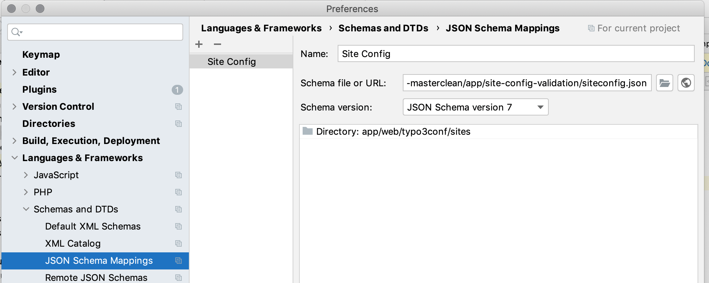

# Validating site config of #TYPO3

This is a **proof of concept** validating the TYPO3 site configuration.

## Setup

Until this repository is available in public, clone it and setup it in our IDE.

### PhpStorm

1. Open PhpStorm and switch to *File > Preferences > Languages & Frameworks > Schemas and DTDs > JSON Schema Mappings*
2. Add a new entry and provide the path to the schema file
3. Provide path to the directory containg the yaml files.



### All other IDEs

TBD, I guess google should help

## Next steps

1. Finish site config

## Testing

```bash
cd tests
npm install
npm test
```
Thanks to https://github.com/buildkite/pipeline-schema/ for inspiration
