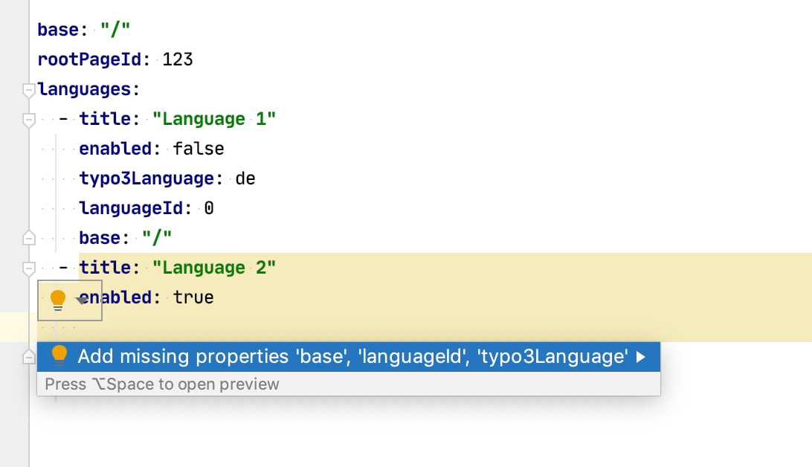

# Validating site config of #TYPO3

[](https://paypal.me/georgringer/10)


This is a **proof of concept** validating the TYPO3 site configuration.




## Setup

### PhpStorm

1. Open PhpStorm and switch to *File > Preferences > Languages & Frameworks > Schemas and DTDs > JSON Schema Mappings*
2. Add a new entry with the following options
   - **Schema file or URL**: `https://raw.githubusercontent.com/georgringer/site-config-validation/master/siteconfig.json`
   - **File path Pattern**: `**/sites/*/config.yaml`
3. Provide path to the directory containg the yaml files.

**IMPORTANT:** Currently I have troubles with validation having the schema remotely. I propose to clone the repository and define the path to the siteconfig.json file!


### All other IDEs

TBD, I guess google should help

## Say thanks

If you find validation useful, please support me:

- **Patreon**: Support me on [patreon.com](https://www.patreon.com/georgringer) and get access to additional extensions and snippets as reward.
- **PayPal**: Support me by a donation on [paypal.com](https://www.paypal.me/GeorgRinger/10). It is just one click away.
- **Amazon Wishlist**: Satisfy a wish of my [Amazon wishlist](https://www.amazon.de/hz/wishlist/ls/8F573K08TSDG).


## Next steps

1. Finish site config

## Testing

```bash
cd tests
npm install
npm test
```
Thanks to https://github.com/buildkite/pipeline-schema/ for inspiration
